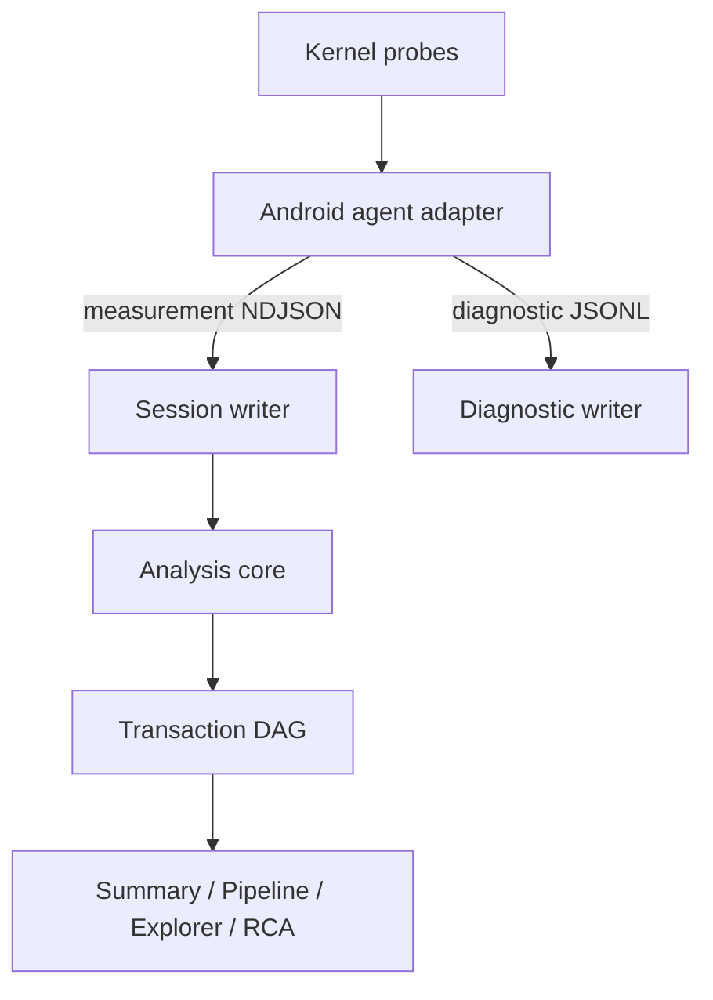

# Design — Deep I/O Attribution & Pipeline

- Artifact: `design@1`
- Status: `CONFIRMED`
- Derived from: `spec@1`

## Domain vision

- Core: 관측된 storage 사건을 근거가 보존된 I/O transaction graph로 재구성한다.
- Supporting: Android probe adaptation, session persistence, diagnostic logging, UI rendering.
- Boundary: tool이 직접 관측하거나 명시적으로 파생한 사실만 소유한다. vendor firmware 내부 원인은 소유하지 않는다.

## Context map

1. **Kernel Capture**는 bounded binary event와 counter를 생성한다.
2. **Android Agent**는 runtime layout, file metadata/path snapshot, structured diagnostics를 더해 protocol record로 번역한다.
3. **Analysis Core**는 typed observation을 node/edge graph로 만들고 confidence/invariants/time accounting을 적용한다.
4. **Desktop Session**은 measurement와 diagnostic stream을 분리해 보존한다.
5. **Desktop UI**는 graph, waterfall, summary, RCA를 같은 selection/filter state로 표시한다.

## Architecture

## Key design

- Protocol v4는 기존 typed events를 유지하며 `FileIdentity`, `PathSnapshot`, `IoNode`, `IoEdge`, `DiagnosticRecord`, 확장 `Health`를 additive하게 추가한다.
- `AnalysisEngine`은 raw events와 graph nodes/edges를 함께 보존한다. legacy v3 event는 import adapter가 node로 승격한다.
- `TransactionGraphBuilder`는 node registry, adjacency, TTL-bounded candidate indexes를 소유한다. direct correlation과 heuristic correlation policy를 분리한다.
- `CorrelationEvidence`는 pointer 자체가 아니라 opaque session-local token과 match feature만 export한다.
- 파일 identity fallback은 agent의 `/proc/<pid>/fd/<fd>` metadata와 symlink snapshot이다. 직접 kernel file identity가 없는 경로는 Exact가 아니다.
- lower-stack collector는 발견된 tracepoint format에 필요한 field가 있을 때만 attach한다. UFS/SCSI/FS adapter는 독립 optional probe이며 generic block 실패로 전파하지 않는다.
- 진단은 agent stderr JSONL과 host rotating JSONL로 분리한다. GUI용 diagnostic message도 같은 schema를 사용한다.

## Critical algorithms

### File↔block probable matching

1. direction과 completed/requested byte compatibility 검사.
2. file syscall interval 종료부터 block insert/issue까지 bounded window 검사.
3. pid/tid direct match가 있으면 우선하되 writeback kernel thread는 file identity evidence가 없으면 Exact 금지.
4. 후보가 하나일 때만 Probable edge 생성; 둘 이상이면 Unattributed와 `AMBIGUOUS_CANDIDATES`.

### Time accounting

- Inclusive: node span duration.
- Exclusive: node interval에서 additive direct/descendant child union을 제한하여 차감.
- Accounted: transaction bounds 내 additive span union.
- Critical path: DAG topological order에서 node duration 기반 longest path.
- ContextOnly는 모든 합계에서 제외.

### RCA

- cohort key: operation/access pattern/size class.
- 선택 transaction의 stage duration을 cohort median과 비교한다.
- 가장 큰 positive delta를 설명하되 edge confidence와 sample count를 함께 제공한다.

## Error model

- `CAPABILITY_UNAVAILABLE`, `LAYOUT_UNSUPPORTED`, `PROBE_LOAD_FAILED`, `PROBE_ATTACH_FAILED`
- `EVENT_DECODE_REJECTED`, `EVENT_SEQUENCE_GAP`, `RING_RESERVE_FAILED`
- `CORRELATION_AMBIGUOUS`, `CORRELATION_EXPIRED`, `KEY_REUSED`, `GRAPH_CYCLE_REJECTED`
- `SESSION_INTEGRITY_MISMATCH`, `SESSION_PARTIAL`, `LOG_WRITE_FAILED`, `EXPORT_FAILED`

오류는 계층 local failure로 격리한다. mandatory block issue/complete만 capture 전체를 중단한다.

## Security and data safety

- measurement session은 분석 기능상 full path를 포함할 수 있다.
- diagnostic log는 full path/serial/payload를 기본 기록하지 않고 bounded opaque reference를 사용한다.
- diagnostic bundle은 raw session/full path를 opt-in으로만 포함한다.

## Rollout

- Protocol reader부터 additive 배포하고 writer를 v4로 전환한다.
- optional probe는 capability flag로 독립 활성화한다.
- 문제가 생기면 lower-stack/deep profile을 끄고 generic block + legacy import를 유지한다.
